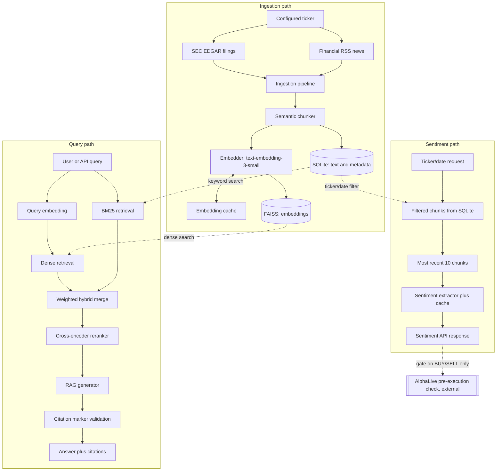

# AlphaSignal

A financial RAG service that answers questions about SEC filings and news with source-linked citations, and separately scores sentiment per ticker - an optional signal source consumed by [AlphaLive](https://github.com/bernardoguterres/AlphaLive), an execution and risk-management engine.

## Status and evidence boundary

**Portfolio release.** The pipeline below runs end to end against a real local corpus, not a mocked design. What that does and doesn't prove:

- **Runtime-verified:** the architecture executes. Citation integrity was checked against live queries (zero unresolved references); the `/sentiment/{ticker}` no-data path and AlphaLive's gate-bypass behavior were exercised against the running service.
- **Not benchmarked:** retrieval quality has never been measured - the golden set exists but is unannotated, see [Evaluation status](#evaluation-status). No MRR/NDCG/Hit@k numbers appear here. A separate sentiment dataset exists but does not establish validated accuracy.
- **Not deployed:** Railway configuration is present and internally consistent, but has not been exercised as a running deployment.
- **209/209 tests passing, 93% coverage** - validates software behavior, not retrieval relevance or sentiment accuracy.

Nothing is investment advice.

## Engineering highlights

- **Hybrid retrieval, not single-mode search.** Dense (FAISS cosine similarity) catches semantic matches ("revenue" ~ "sales"); BM25 catches exact keyword matches embeddings can blur. Scores are min-max normalized and combined with a configurable weight (default 40% BM25 / 60% dense).
- **Cross-encoder reranking as a second pass.** The hybrid merge over-fetches candidates, then `cross-encoder/ms-marco-MiniLM-L-6-v2` scores each query-chunk pair jointly for a precision pass the bi-encoder stage can't do cheaply.
- **Citation integrity is an enforced invariant, not a hope.** `_parse_citations()` renumbers every resolvable `[Source N]` marker sequentially and strips any marker referencing a chunk beyond what was retrieved, so `citations` and the text's markers always line up - a real, fixed defect (see [`generator.py`](alphasignal/generation/generator.py)): earlier behavior could drop an out-of-range citation while leaving its dangling text in the answer.
- **Explicit no-data AND degradation semantics.** `/sentiment/{ticker}` flags "never ingested" (`data_available: false`, `status: "no_data"`) as distinct from having data, and now also flags a provider/parsing fallback as `status: "degraded"` distinct from genuine (possibly zero) sentiment - a fully-failed extraction returns `latest_score: null`, never a fabricated `0.0`. See [Sentiment and AlphaLive integration](#sentiment-and-alphalive-integration) and [`docs/sentiment_contract.md`](docs/sentiment_contract.md).
- **AlphaLive integration is fail-open and scoped to entries**, not exits. If unreachable, disabled, or lacking data, AlphaLive bypasses the gate and runs its normal risk/execution checks - runtime-tested locally, not validated under live trading.

## Architecture



FAISS and SQLite are complementary, not overlapping: FAISS holds only chunk embeddings and IDs, SQLite holds chunk text and metadata. Retrieval queries both and joins on `chunk_id`. Sentiment never touches the query path's reranked chunks - it pulls its own ticker/date-filtered set from SQLite. AlphaLive is an external consumer of `/sentiment/{ticker}`, not part of this repository.

## Ingestion and storage

`IngestionPipeline` (`alphasignal/ingestion/pipeline.py`) fetches SEC EDGAR filings and RSS news per ticker, then chunks them with `SemanticChunker`: `target_tokens` (default 300) drives ordinary boundary decisions - a chunk closes once it reaches this size; `max_tokens` (default 400) is the hard ceiling, used to force-split a single oversized sentence and to cap `target_tokens` if it's ever configured above `max_tokens`; `min_tokens` (default 100) is a configured minimum used during final-chunk handling, not an absolute lower bound; `overlap_tokens` (default 50) is a maximum budget for carrying complete trailing sentences forward, not a guaranteed floor.

Chunks are embedded via OpenAI (`text-embedding-3-small`), cached by a deterministic source-derived chunk ID: ticker/filing-date/accession-number/index for filings, ticker/URL/index for news. Storage splits across two places: **SQLite** (`data/metadata.db`) holds chunk text and metadata; **FAISS** (`data/faiss_index/`) holds normalized embeddings in an `IndexFlatIP` index, addressed by the same chunk IDs. Both dedupe on chunk ID *and* a content fingerprint (`content_hash`, sha256 of the chunk text): unchanged re-ingestion under the same ID is a genuine no-op (no re-embedding, no re-indexing), while a content change under an unchanged ID (e.g. an amended filing) re-embeds and replaces the stale vector rather than silently keeping it (see [Known limitations](#known-limitations) for the FAISS-side rebuild trade-off).

The BM25 index is built in memory at API startup and rebuilt after each ingestion call - not persisted to disk.

**Local corpus evidence, not committed data:** `data/` is gitignored, so the numbers below describe this machine's local corpus, not what ships in or is reproducible from the repository. As of this writing, `data/metadata.db` holds **42,078 chunks** across 12 tickers (AAPL, MSFT, GOOGL, AMZN, NVDA, META, TSLA, JPM, GS, MS, SPY, QQQ), with SEC filing coverage split across 2015–2019 (a historical backfill) and 2024–2026 (regular ingestion) - **2020 through 2023 has no ingested data for any ticker**. Requests explicitly constrained to that window get documented no-data behavior, not a stale or fabricated result: `/sentiment/{ticker}` returns `data_available: false` with `latest_score: null`; `/query` (no `data_available` field) returns its no-relevant-information answer with an empty `citations` array.

## Hybrid retrieval and cited generation

`HybridRetriever.retrieve()` runs dense FAISS and sparse BM25 search independently (each over its own candidate pool, default 50), min-max normalizes both score sets, and combines them with configurable weights (default `bm25: 0.4, dense: 0.6`). The top `rerank_candidates` (default 20) go to `CrossEncoderReranker`, which scores each query-chunk pair jointly and returns the requested `top_k` (default 5, max 20).

`RAGGenerator` builds a numbered `[Source N]` context block from the reranked chunks and asks the model to answer only from it. `_parse_citations()` then enforces the citation-integrity invariant above before returning the response.

## Sentiment and AlphaLive integration

`/sentiment/{ticker}` pulls ticker/date-filtered chunks from SQLite, independently of the query path, then `extract_ticker_sentiment()` sorts by date descending and runs **at most the 10 most recent chunks** - not the full set - through `SentimentExtractor`. Results are cached per chunk in memory (not persisted) for 24 hours, resetting on restart.

Five cases matter, not three: **no stored chunks** (`data_available: false`, `status: "no_data"`, `latest_score: null`); **genuine extraction, including genuine neutral** (`status: "ok"`, `degraded: false`, `latest_score` may legitimately be `0.0`); **partial degradation** - one or more chunks fell back to a provider/parsing default (`status: "degraded"`, `degradation_reason: "partial_extraction_failure"`, `latest_score` still reflects the most recent *reliable* chunk, not discarded); **full degradation** - every chunk fell back (`status: "degraded"`, `degradation_reason: "full_extraction_failure"`, `latest_score: null` - never fabricated as `0.0`); and **route/storage/other unhandled failures**, which raise and surface as HTTP 5xx, never a 200. Per-chunk `SentimentSignal.reliable` and response-level `reliable_chunk_count`/`total_chunk_count` make the fallback-vs-genuine distinction explicit and machine-readable instead of inferring it from confidence/summary text. Full contract: [`docs/sentiment_contract.md`](docs/sentiment_contract.md).

AlphaLive's `run_pre_execution_checks()` consults `/sentiment/{ticker}` only for strategy-generated BUY/SELL signals, never for stop-loss/take-profit/trailing-stop exits. A BUY is blocked by sufficiently negative sentiment (default threshold -0.3), a SELL by sufficiently positive sentiment; HOLD never consults the gate. Timeout, network/HTTP error, a disabled integration, or an explicit no-data response all bypass the gate - AlphaLive falls through to its normal risk/execution checks, not a guaranteed order. AlphaLive normalizes the API response to `sentiment_score`, `confidence`, `sources`, `latency_ms`, and `data_available`; its allow/block decision uses `sentiment_score` and does not yet consume `status`/`degraded`/`reliable` - that's additive metadata this AlphaSignal-side pass adds, not a cross-repo behavior change. A degraded-but-nonzero fallback score therefore still passes through AlphaLive's gate like a genuine score today.

This is a local runtime test, not a live-trading validation: both services against the real corpus, bypass behavior confirmed on "no data" and "error" paths. AlphaLab does not call this API - it uses `yfinance` directly.

## Evaluation status

There are two separate, unrelated evaluation assets - do not confuse them:

| Asset | Purpose | Size | Status |
|---|---|---|---|
| `evaluation/retrieval_golden_set.json` | Retrieval quality (MRR/NDCG/Hit@k) | 50 questions, 10 tickers | **Unannotated** - `relevant_chunk_ids` empty everywhere |
| `alphasignal/evaluation/sentiment_golden_set.json` | Event-sentiment/forward-return diagnostic fixture | 15 labeled events | Labeled, but methodologically unsound as an accuracy measure - see below |

**Retrieval:** `benchmark.py` refuses to run against the unannotated set rather than report meaningless all-zero metrics; annotation (`annotate_golden_set.py`) must happen first. Its four configurations only vary hybrid weighting and reranking - "naive vs. semantic chunking" labels are aspirational, since only `SemanticChunker` exists and every row evaluates the same corpus (a warning is logged).

**Sentiment:** the 15-entry set has explicit `expected_sentiment` labels tied to historical events, but `run_eval.py` doesn't evaluate what it might appear to. It calls `GET /sentiment/{ticker}?date_to=<event_date>`, never submitting the event description to the model - so it scores retrieved corpus context around the event date, not the described event text itself. This is a real, distinct evaluation design (documented explicitly in `run_eval.py`'s module docstring), not a scoring bug by itself. What *was* a bug (fixed 2026-09-11): when a prediction was unavailable, the runner substituted `expected_sentiment` - the ground-truth label - into the correctness check, scoring the label against itself and inflating every unavailable-prediction row into an apparent "correct" prediction; the same substitution corrupted the Sharpe-style backtest, which used to build its trading signal from `expected_sentiment` rather than the model's actual prediction. Both are fixed: accuracy and Sharpe are now computed only over genuine, non-neutral, available predictions, with prediction coverage (`predictions_available / actionable`) reported as an explicit, separate number - see `alphasignal/tests/test_run_eval_metrics.py`. Several events still fall inside the 2020-2023 corpus gap with no matching data, which now correctly shows up as reduced coverage rather than a substituted, misleadingly "correct" result. Committed dated result files document this diagnostic fixture's output, not validated accuracy.

**Bottom line:** retrieval quality is unmeasured; no validated sentiment or predictive-quality claim is made - the leakage fix above corrects how the diagnostic fixture is scored, it does not establish a new accuracy figure. Closing the gap needs the retrieval questions annotated and benchmarked, and corpus coverage extended to reduce how often "unavailable" is the answer.

## API example

Shapes below match `alphasignal/api/schemas.py`. Answer text, scores, and latency are **illustrative** - representative, not a captured live response.

```bash
curl -X POST http://localhost:8000/query \
  -H "Content-Type: application/json" \
  -d '{"query": "What were Apple'\''s key revenue drivers in fiscal 2024?", "ticker_filter": "AAPL", "top_k": 5}'
```

```json
{
  "query": "What were Apple's key revenue drivers in fiscal 2024?",
  "answer": "Driven primarily by iPhone sales and continued growth in Services [Source 1].",
  "citations": [
    {
      "chunk_id": "aapl_10k_a1b2c3d4_0007",
      "ticker": "AAPL",
      "source": "SEC EDGAR",
      "date": "2024-09-28",
      "excerpt": "iPhone revenue increased year-over-year...",
      "relevance_score": 0.91
    }
  ],
  "latency_ms": 340,
  "retrieval_scores": [0.91, 0.84],
  "model_used": "gpt-5.6-luna"
}
```

`ticker_filter` is a single string, not a list - the retrieval stack only ever supported one ticker per query.

## Quick Start

```bash
git clone https://github.com/bernardoguterres/AlphaSignal.git
cd AlphaSignal
python -m venv venv && source venv/bin/activate
pip install -r requirements.txt
export OPENAI_API_KEY=your_key_here

# Build the corpus (real OpenAI embedding calls - costs money)
python alphasignal/scripts/build_corpus.py

# Start the API
uvicorn alphasignal.api.app:app --reload --host 0.0.0.0 --port 8000
# docs at http://localhost:8000/docs
```

## Compact API reference

| Endpoint | Purpose | Auth |
|---|---|---|
| `POST /query` | Hybrid retrieval + reranked, cited RAG answer | X-API-Key when configured |
| `GET /sentiment/{ticker}` | Per-document sentiment signals, optional date range | X-API-Key when configured |
| `GET /sentiment/{ticker}/summary` | Aggregate score, trend, count | X-API-Key when configured |
| `POST /ingest/{ticker}` | Full ingest → chunk → embed → store | X-API-Key when configured |
| `POST /ingest/batch` | Multi-ticker ingest, one BM25 rebuild | X-API-Key when configured |
| `GET /health` | FAISS/SQLite load status, chunk count | None (healthcheck can't send headers) |
| `GET /metrics` | Latency percentiles, error counts | X-API-Key when configured |

Ticker allowlist checking isn't uniform: `GET /sentiment/{ticker}` (and `/summary`) and `POST /ingest/{ticker}` return `404` for an unknown ticker; `POST /ingest/batch` records it as `"failed"` instead; `POST /query`'s `ticker_filter` performs no allowlist check - an unrecognized value just yields no matching chunks.

## Configuration and deployment status

**Environment variables:** `OPENAI_API_KEY` (required); `ALPHASIGNAL_API_KEY` (recommended before public exposure) - when set, every route except `/health` requires a matching `X-API-Key` header. Unset means open access, logged as a startup warning - fine locally, not for a reachable deployment, since open `/query`/`/ingest` lets anyone spend the OpenAI budget.

**`config.yaml`** controls tickers, chunking, retrieval weights/candidate pools, model names, and storage paths.

**Railway:** `Dockerfile`, `Procfile`, and `railway.toml` are internally consistent, but **an actual deployment has not been exercised** - local configuration, not deployment evidence. `data/` is excluded from the Docker image; a real deployment needs a persistent volume at `/app/data`, or every redeploy wipes the corpus.

## Verification

209 tests pass (`pytest`, ~32s), 93% statement coverage (`pytest --cov=alphasignal`). These tests check software correctness - schemas, citation-marker parsing, filter logic, caching, error handling, no-data semantics - not whether retrieval finds the right chunks or sentiment scores are accurate. Neither is currently measurable: see [Evaluation status](#evaluation-status) for why the sentiment set doesn't substitute for accuracy measurement and why the retrieval golden set remains unannotated.

## Known limitations

- **Retrieval quality is unmeasured; sentiment quality is unvalidated** - see [Evaluation status](#evaluation-status).
- **2020–2023 corpus gap.** No ingested data exists for any ticker in this window; requests explicitly constrained to that period get `/sentiment/{ticker}` returning `data_available: false` and `/query` returning an empty-citations result, rather than a wrong answer.
- **Chunking boundary rules.** `target_tokens` now drives the ordinary boundary (fixed 2026-09-11; previously configured but unused); `max_tokens` remains the hard ceiling. A short document can still yield a chunk below `min_tokens`, and a short trailing fragment can still merge into the previous chunk, pushing it past `max_tokens` (deliberate: dropping real content would be worse). Overlap is a maximum budget for complete trailing sentences, not a guaranteed floor; a hard-split oversized sentence gets none.
- **Chunk IDs are source-derived, not content-derived** (doc/article + section + position, not the text itself) - a content fingerprint (`content_hash`, sha256 of the chunk text) is computed alongside and used by the embedding cache and FAISS vector store to detect when text changed under an unchanged chunk_id, so re-ingestion re-embeds and replaces the stale vector instead of silently keeping it (fixed 2026-09-11). Replacing a vector rebuilds the local FAISS index from its current vectors plus the new one, since `IndexFlatIP` has no update/remove-by-position primitive - documented, deliberate trade-off, fine at this project's local/batch scale, not a design for high-churn or large-scale deployment.
- **Railway deployment unexercised** - configuration is internally consistent, but no live deployment has been run.
- **Scale trade-offs typical of an MVP:** synchronous ingestion (~45s/ticker) uses plain `def` handlers, which FastAPI normally runs in its thread pool rather than blocking the event loop directly, but a long ingestion request still consumes worker capacity and there is no queued/background ingestion architecture; no `/query` response caching (sentiment is cached per-chunk in memory for 24h, lost on restart); single-node, in-memory FAISS with no distributed scaling.
- **AlphaLive integration is a local runtime test, not live-trading validation**, and only gates BUY/SELL signals, never exits.
- **AlphaLab is not connected** - it calls `yfinance` directly.

## License and contributions

All rights reserved - proprietary work; no license is granted for reuse, copying, or redistribution. Contribution pull requests are welcome for review at the maintainer's discretion, but do not grant anyone a license to the rest of the codebase.
