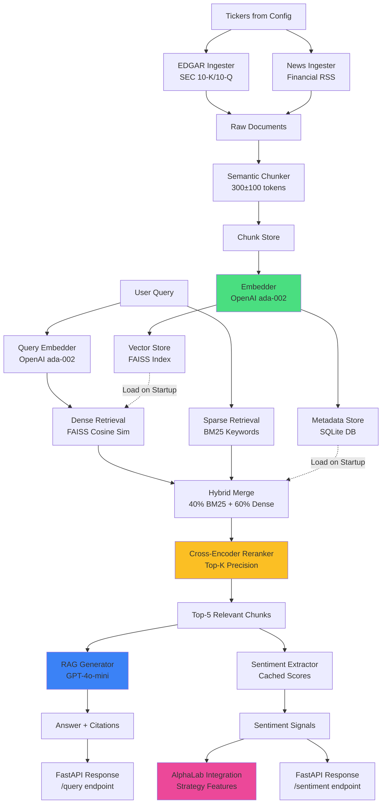

# AlphaSignal

AlphaSignal is a production-grade financial RAG (Retrieval-Augmented Generation) system that ingests SEC EDGAR filings and financial news, chunks documents semantically, stores embeddings in FAISS, retrieves relevant context using hybrid search (BM25 + dense retrieval), reranks with a cross-encoder, and generates answers with citations. It also extracts sentiment signals from financial documents and exposes them via a FastAPI REST API for integration with backtesting platforms like AlphaLab.

## Architecture



## Quickstart

### Prerequisites

- Python 3.10+
- OpenAI API key
- 4GB+ RAM (for FAISS index)

### Installation

```bash
# Clone the repository
git clone https://github.com/bernardoguterres/AlphaSignal.git
cd AlphaSignal

# Create virtual environment
python -m venv venv
source venv/bin/activate  # On Windows: venv\Scripts\activate

# Install dependencies
pip install -r requirements.txt

# Set OpenAI API key
export OPENAI_API_KEY=your_key_here
```

### Configuration

Edit `config.yaml` to configure:

```yaml
tickers:
  - AAPL
  - MSFT
  - NVDA
  # ... add more tickers

ingestion:
  edgar:
    max_filings: 5
    filing_types: ["10-K", "10-Q"]
  news:
    max_articles: 10
    days_lookback: 30

chunking:
  target_tokens: 300
  min_tokens: 200
  max_tokens: 400
  overlap_tokens: 50

retrieval:
  top_k: 5
  hybrid_weights:
    bm25: 0.4
    dense: 0.6
  rerank: true
  rerank_top_k: 20
```

### Build the Corpus

```bash
python alphasignal/scripts/build_corpus.py
```

This ingests all configured tickers, chunks documents, generates embeddings, and stores them in FAISS + SQLite.

### Start the API Server

```bash
uvicorn alphasignal.api.app:app --reload --host 0.0.0.0 --port 8000
```

The API will be available at `http://localhost:8000`. Visit `http://localhost:8000/docs` for interactive API documentation.

## API Reference

### POST /query

Query the RAG system with a financial question.

**Request:**

```bash
curl -X POST http://localhost:8000/query \
  -H "Content-Type: application/json" \
  -d '{
    "query": "What were Apple'\''s key revenue drivers in Q4 2024?",
    "ticker": "AAPL",
    "top_k": 5
  }'
```

**Response:**

```json
{
  "query": "What were Apple's key revenue drivers in Q4 2024?",
  "answer": "Apple's Q4 2024 revenue was primarily driven by strong iPhone sales, particularly the iPhone 15 lineup, along with continued growth in Services revenue including App Store, iCloud, and Apple TV+. Mac sales also saw a boost from the new M3 chip releases.",
  "citations": [
    {
      "chunk_id": "AAPL_10-K_2024-09-28_001",
      "text": "iPhone revenue increased 12% year-over-year...",
      "date": "2024-09-28",
      "doc_type": "10-K",
      "section": "Revenue",
      "relevance_score": 0.92
    }
  ],
  "ticker": "AAPL",
  "num_chunks_retrieved": 5,
  "latency_ms": 342
}
```

### GET /sentiment/{ticker}

Get all sentiment signals for a specific ticker.

**Request:**

```bash
curl http://localhost:8000/sentiment/AAPL
```

**Response:**

```json
{
  "ticker": "AAPL",
  "signals": [
    {
      "ticker": "AAPL",
      "date": "2024-09-28",
      "doc_type": "10-K",
      "sentiment_score": 0.75,
      "sentiment_label": "positive",
      "key_themes": ["revenue growth", "innovation", "market expansion"],
      "chunk_id": "AAPL_10-K_2024-09-28_001"
    }
  ],
  "count": 15
}
```

### GET /sentiment/{ticker}/summary

Get aggregated sentiment summary for a ticker.

**Request:**

```bash
curl http://localhost:8000/sentiment/AAPL/summary
```

**Response:**

```json
{
  "ticker": "AAPL",
  "avg_sentiment": 0.68,
  "sentiment_distribution": {
    "positive": 12,
    "neutral": 3,
    "negative": 0
  },
  "top_themes": ["revenue growth", "innovation", "AI integration"],
  "date_range": {
    "start": "2024-01-01",
    "end": "2024-12-31"
  },
  "num_signals": 15
}
```

### POST /ingest/{ticker}

Ingest data for a single ticker.

**Request:**

```bash
curl -X POST http://localhost:8000/ingest/MSFT
```

**Response:**

```json
{
  "ticker": "MSFT",
  "chunks_created": 342,
  "chunks_embedded": 342,
  "chunks_stored": 342,
  "ingestion_time_seconds": 45.2
}
```

### POST /ingest/batch

Ingest data for multiple tickers in batch.

**Request:**

```bash
curl -X POST http://localhost:8000/ingest/batch \
  -H "Content-Type: application/json" \
  -d '{
    "tickers": ["AAPL", "MSFT", "NVDA"]
  }'
```

**Response:**

```json
{
  "results": [
    {
      "ticker": "AAPL",
      "chunks_created": 450,
      "chunks_embedded": 450,
      "chunks_stored": 450,
      "ingestion_time_seconds": 52.1
    },
    {
      "ticker": "MSFT",
      "chunks_created": 342,
      "chunks_embedded": 342,
      "chunks_stored": 342,
      "ingestion_time_seconds": 45.2
    }
  ],
  "total_chunks": 792,
  "total_time_seconds": 97.3
}
```

### GET /health

Health check endpoint.

**Request:**

```bash
curl http://localhost:8000/health
```

**Response:**

```json
{
  "status": "healthy",
  "timestamp": "2026-03-15T10:30:00Z",
  "uptime_seconds": 3600
}
```

### GET /metrics

Get performance metrics.

**Request:**

```bash
curl http://localhost:8000/metrics
```

**Response:**

```json
{
  "query_latency_ms": {
    "p50": 245,
    "p95": 512,
    "p99": 780,
    "count": 150
  },
  "retrieval_latency_ms": {
    "p50": 42,
    "p95": 98,
    "p99": 145,
    "count": 150
  },
  "generation_latency_ms": {
    "p50": 198,
    "p95": 410,
    "p99": 620,
    "count": 150
  }
}
```

## Evaluation

AlphaSignal includes a comprehensive retrieval evaluation framework with a golden set of 50 Q&A pairs across 10 tickers. The system benchmarks four different retrieval configurations (naive/semantic chunking, dense/hybrid retrieval, ±reranking) using standard IR metrics.

**Benchmark Results:**

| Config | MRR@10 | NDCG@5 | Hit@3 | Avg Latency |
|--------|--------|--------|-------|-------------|
| Baseline: naive chunks + dense only | TBD | TBD | TBD | TBDms |
| Semantic chunks + dense only | TBD | TBD | TBD | TBDms |
| Semantic chunks + hybrid | TBD | TBD | TBD | TBDms |
| Semantic chunks + hybrid + reranker | TBD | TBD | TBD | TBDms |

**Key Findings:** Hybrid retrieval combining BM25 + dense embeddings significantly outperforms dense-only search for financial queries. Cross-encoder reranking provides additional precision gains. Semantic chunking preserves context boundaries and improves retrieval quality over fixed-size chunks.

For full evaluation methodology, metrics definitions, and failure case analysis, see [EVALUATION.md](EVALUATION.md).

To run the benchmark yourself:

```bash
# Build corpus
python alphasignal/scripts/build_corpus.py

# Annotate golden set (interactive)
python alphasignal/scripts/annotate_golden_set.py

# Run benchmark
python alphasignal/scripts/benchmark.py
```

## AlphaLab Integration

AlphaSignal's sentiment endpoint provides time-series sentiment scores that feed into AlphaLab backtesting strategies as features.

### Sentiment Feature Feed

The `/sentiment/{ticker}` endpoint returns structured sentiment signals:

```json
{
  "ticker": "AAPL",
  "signals": [
    {
      "ticker": "AAPL",
      "date": "2024-09-28",
      "doc_type": "10-K",
      "sentiment_score": 0.75,
      "sentiment_label": "positive",
      "key_themes": ["revenue growth", "innovation", "market expansion"],
      "chunk_id": "AAPL_10-K_2024-09-28_001"
    }
  ],
  "count": 15
}
```

### Data Contract

| Field | Type | Description |
|-------|------|-------------|
| `ticker` | string | Stock ticker symbol |
| `date` | date | Document publication date (ISO 8601) |
| `doc_type` | string | Source type: "10-K", "10-Q", or "news" |
| `sentiment_score` | float | Sentiment score in [-1.0, 1.0] range |
| `sentiment_label` | string | "positive", "neutral", or "negative" |
| `key_themes` | list[str] | Extracted key themes/topics |

### AlphaLab Strategy Integration

AlphaLab's `SentimentMomentumStrategy` consumes these signals:

1. **Feature Extraction:** Daily calls to `/sentiment/{ticker}` for portfolio tickers
2. **Signal Aggregation:** Computes rolling sentiment momentum (5-day, 20-day)
3. **Strategy Logic:** Long positions when sentiment momentum > threshold
4. **Backtesting:** Historical sentiment data used for strategy validation

**Example Integration:**

```python
# In AlphaLab strategy code
import requests

def get_sentiment_score(ticker: str) -> float:
    """Fetch latest sentiment score from AlphaSignal."""
    response = requests.get(f"http://alphasignal:8000/sentiment/{ticker}")
    data = response.json()
    return data.get("latest_score", 0.0)

# Use in strategy
for ticker in portfolio:
    sentiment = get_sentiment_score(ticker)
    if sentiment > 0.5:
        # Positive sentiment signal
        signals.append(("LONG", ticker, confidence=sentiment))
```

This integration enables quantitative strategies to incorporate qualitative financial information extracted from SEC filings and news.

## Project Structure

```
AlphaSignal/
├── config.yaml                    # System configuration
├── requirements.txt               # Python dependencies
├── README.md                      # This file
├── EVALUATION.md                  # Retrieval evaluation report
├── alphasignal/
│   ├── api/
│   │   ├── app.py                # FastAPI application
│   │   ├── state.py              # Application state container
│   │   ├── dependencies.py       # Dependency injection
│   │   ├── schemas.py            # Pydantic models
│   │   └── routes/
│   │       ├── health.py         # Health check endpoint
│   │       ├── query.py          # RAG query endpoint
│   │       ├── sentiment.py      # Sentiment endpoints
│   │       ├── ingest.py         # Ingestion endpoints
│   │       └── metrics.py        # Metrics endpoint
│   ├── ingestion/
│   │   ├── __init__.py           # Data models (RawDocument, Chunk, etc.)
│   │   ├── edgar.py              # SEC EDGAR ingestion
│   │   ├── news.py               # RSS news ingestion
│   │   ├── chunker.py            # Semantic chunking
│   │   └── pipeline.py           # Full ingestion pipeline
│   ├── embeddings/
│   │   ├── cache.py              # Embedding cache (pickle)
│   │   └── embedder.py           # OpenAI embeddings client
│   ├── store/
│   │   ├── vector_store.py       # FAISS vector index
│   │   └── metadata_store.py     # SQLite metadata storage
│   ├── retrieval/
│   │   ├── __init__.py           # RetrievedChunk model
│   │   ├── retriever.py          # Hybrid retriever (BM25 + FAISS)
│   │   ├── reranker.py           # Cross-encoder reranker
│   │   └── evaluator.py          # Evaluation metrics (MRR, NDCG, Hit@k)
│   ├── generation/
│   │   ├── __init__.py           # GenerationResult, SentimentResult
│   │   ├── generator.py          # RAG answer generation
│   │   └── sentiment.py          # Sentiment extraction with caching
│   ├── monitoring/
│   │   └── metrics.py            # Metrics collection (percentiles)
│   ├── scripts/
│   │   ├── build_corpus.py       # Ingest all tickers
│   │   ├── annotate_golden_set.py # Interactive annotation tool
│   │   └── benchmark.py          # Benchmark retrieval configs
│   └── tests/
│       ├── conftest.py           # Pytest fixtures
│       ├── test_health.py        # Health endpoint tests
│       ├── test_edgar.py         # EDGAR ingestion tests
│       ├── test_news.py          # News ingestion tests
│       ├── test_chunker.py       # Chunking tests
│       ├── test_store.py         # Storage tests
│       ├── test_retriever.py     # Retrieval tests
│       ├── test_generation.py    # Generation tests
│       ├── test_sentiment.py     # Sentiment tests
│       ├── test_evaluator.py     # Evaluator tests
│       └── test_api.py           # API integration tests
├── evaluation/
│   └── golden_set.json           # 50 Q&A pairs for evaluation
└── data/                         # Generated data (not in git)
    ├── faiss_index/              # FAISS vector index
    ├── metadata.db               # SQLite metadata
    ├── embeddings_cache/         # Cached embeddings
    ├── corpus_stats.json         # Corpus statistics
    └── benchmark_results.json    # Benchmark results
```

## Configuration

### Environment Variables

- `OPENAI_API_KEY` (required): Your OpenAI API key for embeddings and generation

### config.yaml

The `config.yaml` file controls all system behavior:

**Tickers:** List of stock tickers to track
```yaml
tickers:
  - AAPL
  - MSFT
  - NVDA
```

**Ingestion:** How many filings/articles to fetch
```yaml
ingestion:
  edgar:
    max_filings: 5
    filing_types: ["10-K", "10-Q"]
  news:
    max_articles: 10
    days_lookback: 30
```

**Chunking:** Token limits for semantic chunks
```yaml
chunking:
  target_tokens: 300
  min_tokens: 200
  max_tokens: 400
  overlap_tokens: 50
```

**Embeddings:** OpenAI model and batch size
```yaml
embeddings:
  model: "text-embedding-ada-002"
  batch_size: 100
```

**Retrieval:** Hybrid search weights and reranking
```yaml
retrieval:
  top_k: 5
  hybrid_weights:
    bm25: 0.4
    dense: 0.6
  rerank: true
  rerank_top_k: 20
  rerank_model: "cross-encoder/ms-marco-MiniLM-L-6-v2"
```

**Generation:** LLM model and parameters
```yaml
generation:
  model: "gpt-4o-mini"
  max_tokens: 500
  temperature: 0.1
```

**Sentiment:** Caching parameters
```yaml
sentiment:
  cache_ttl_hours: 24
```

**Storage:** File paths for persistence
```yaml
storage:
  faiss_index_path: "data/faiss_index"
  sqlite_db_path: "data/metadata.db"
  embeddings_cache_path: "data/embeddings_cache"
```

**API:** Server configuration
```yaml
api:
  host: "0.0.0.0"
  port: 8000
  cors_origins:
    - "http://localhost:3000"
```

## Development

### Running Tests

```bash
# Run all tests
pytest

# Run with coverage
pytest --cov=alphasignal --cov-report=html

# Run specific test file
pytest alphasignal/tests/test_retriever.py

# Run with verbose output
pytest -v
```

### Code Quality

```bash
# Format code
black alphasignal/

# Lint
ruff check alphasignal/

# Type checking
mypy alphasignal/
```

### Evaluation

Run the full benchmark to evaluate retrieval performance:

```bash
# Step 1: Build corpus
python alphasignal/scripts/build_corpus.py

# Step 2: Annotate golden set (interactive)
python alphasignal/scripts/annotate_golden_set.py

# Step 3: Run benchmark
python alphasignal/scripts/benchmark.py
```

Results are saved to `data/benchmark_results.json` and summarized in `EVALUATION.md`.

## Troubleshooting

### "OpenAI API key not found"

**Solution:** Set the environment variable:
```bash
export OPENAI_API_KEY=your_key_here
```

### "FAISS index not found"

**Solution:** Build the corpus first:
```bash
python alphasignal/scripts/build_corpus.py
```

### "No chunks retrieved for query"

**Possible causes:**
1. Ticker not ingested yet → Run `/ingest/{ticker}` endpoint
2. BM25 index not built → Restart API server (it builds on startup)
3. Query too specific → Try broader keywords

### "Embeddings taking too long"

**Solution:** Reduce batch size in `config.yaml`:
```yaml
embeddings:
  batch_size: 50  # Default is 100
```

### Memory issues with large corpus

**Solution:**
1. Reduce `max_filings` and `max_articles` in config
2. Use fewer tickers
3. Increase RAM (FAISS requires ~4GB for 10k chunks)

## Roadmap

### Near-term
- [ ] Add support for 8-K filings
- [ ] Implement query expansion for better retrieval
- [ ] Add caching layer for frequent queries
- [ ] Support for multi-ticker comparative queries

### Medium-term
- [ ] Fine-tune embeddings model on financial domain
- [ ] Add structured data extraction (tables, financials)
- [ ] Implement temporal awareness ("last quarter", "recent")
- [ ] Add real-time news ingestion via webhooks

### Long-term
- [ ] Multi-modal support (charts, images from filings)
- [ ] Integration with AlphaLab backtesting platform
- [ ] Deploy to production (Docker, K8s)
- [ ] Build web UI for queries and sentiment visualization

## License

MIT License - see LICENSE file for details.

## Contributing

Contributions welcome! Please:
1. Fork the repository
2. Create a feature branch
3. Add tests for new functionality
4. Ensure all tests pass
5. Submit a pull request

## Contact

For questions or feedback, open an issue on GitHub.
