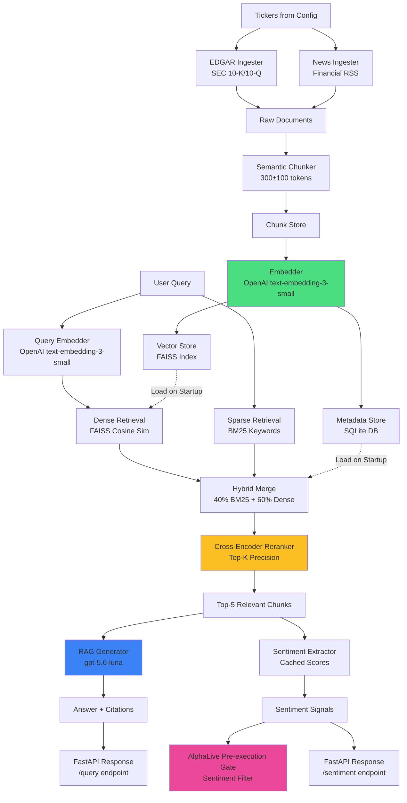

# AlphaSignal

AlphaSignal is the financial RAG (retrieval-augmented generation) and sentiment component of the [Alpha ecosystem](../README.md). It ingests SEC EDGAR filings and financial news, chunks documents semantically, stores embeddings in FAISS, retrieves relevant context using hybrid search (BM25 + dense retrieval), reranks with a cross-encoder, and generates answers with citations. It also extracts sentiment signals from financial documents and exposes them via a FastAPI REST API - consumed by [AlphaLive](https://github.com/bernardoguterres/AlphaLive)'s pre-execution sentiment gate (see [System Integration](#system-integration) below).

**Status: Portfolio release.** The retrieval/generation/sentiment architecture described below genuinely executes end to end against a real ~42k-chunk corpus (runtime-verified, not just designed) - see [Evaluation](#evaluation) for exactly what has and has not been benchmarked. Sentiment scores are a decision-support signal AlphaLive uses as one gate among several (with fail-open semantics when unavailable), not a standalone trading signal, and nothing here is investment advice.

## Architecture



## Quickstart

### Prerequisites

- Python 3.10+
- OpenAI API key
- 4GB+ RAM (for FAISS index)

### Installation

```bash
# Clone the repository
git clone https://github.com/bernardoguterres/AlphaSignal.git
cd AlphaSignal

# Create virtual environment
python -m venv venv
source venv/bin/activate  # On Windows: venv\Scripts\activate

# Install dependencies
pip install -r requirements.txt

# Set OpenAI API key
export OPENAI_API_KEY=your_key_here
```

### Configuration

Edit `config.yaml` to configure:

```yaml
tickers:
  - AAPL
  - MSFT
  - NVDA
  # ... add more tickers

ingestion:
  edgar:
    max_filings: 5
    filing_types: ["10-K", "10-Q"]
  news:
    max_articles: 10
    days_lookback: 30

chunking:
  target_tokens: 300
  min_tokens: 200
  max_tokens: 400
  overlap_tokens: 50

retrieval:
  top_k: 5
  hybrid_weights:
    bm25: 0.4
    dense: 0.6
  rerank: true
  rerank_top_k: 20
```

### Build the Corpus

```bash
python alphasignal/scripts/build_corpus.py
```

This ingests all configured tickers, chunks documents, generates embeddings, and stores them in FAISS + SQLite.

### Start the API Server

```bash
uvicorn alphasignal.api.app:app --reload --host 0.0.0.0 --port 8000
```

The API will be available at `http://localhost:8000`. Visit `http://localhost:8000/docs` for interactive API documentation.

## Deployment (Railway)

`Dockerfile`, `Procfile`, and `railway.toml` are included for deploying alongside AlphaLive.

```bash
railway up
```

Railway assigns `$PORT` at runtime; the Dockerfile and Procfile both bind to it automatically.

**Required env vars:** `OPENAI_API_KEY`. **Strongly recommended:** `ALPHASIGNAL_API_KEY` (enables auth - see Environment Variables below).

**Persistent storage:** `data/` (FAISS index, SQLite metadata, embedding cache) is excluded from the Docker image via `.dockerignore` and is empty on every fresh container. **Mount a Railway Volume at `/app/data`** before ingesting the corpus, or every redeploy silently wipes it and `/sentiment/{ticker}` goes back to returning empty signals for every ticker.

**Wiring up AlphaLive:** once deployed, set `ALPHASIGNAL_URL` to this service's Railway-assigned URL (and `ALPHASIGNAL_ENABLED=true`) in AlphaLive's environment so the sentiment gate can actually reach it - the default `http://localhost:8000` only works when both services run on the same machine.

## API Reference

> The examples below match `alphasignal/api/schemas.py` exactly (verified 2026-07-01) - the response shapes shown here are what the API actually returns, not an aspirational spec.

### POST /query

Query the RAG system with a financial question.

**Request:**

```bash
curl -X POST http://localhost:8000/query \
  -H "Content-Type: application/json" \
  -d '{
    "query": "What were Apple'\''s key revenue drivers in Q4 2024?",
    "ticker_filter": ["AAPL"],
    "top_k": 5
  }'
```

**Response:**

```json
{
  "query": "What were Apple's key revenue drivers in Q4 2024?",
  "answer": "Apple's Q4 2024 revenue was primarily driven by strong iPhone sales, particularly the iPhone 15 lineup, along with continued growth in Services revenue including App Store, iCloud, and Apple TV+.",
  "citations": [
    {
      "chunk_id": "AAPL_10-K_2024-09-28_001",
      "ticker": "AAPL",
      "source": "SEC EDGAR",
      "date": "2024-09-28",
      "excerpt": "iPhone revenue increased 12% year-over-year...",
      "relevance_score": 0.92
    }
  ],
  "latency_ms": 342,
  "retrieval_scores": [0.92, 0.87, 0.81],
  "model_used": "gpt-5.6-luna"
}
```

**Citation integrity:** every `[Source N]` marker in `answer` is guaranteed to resolve to
`citations[N-1]`. This wasn't always true - validation on 2026-08-15 found that the model could
cite a source number beyond the number of chunks actually retrieved, and the API silently dropped
the unresolvable citation from the array without removing the dangling marker from the text.
Citation parsing now renumbers valid citations sequentially and strips any unresolvable marker;
re-verified against live queries on the real corpus with zero unresolved references afterward.

### GET /sentiment/{ticker}

Get all sentiment signals for a specific ticker. Optional `date_from`/`date_to` query params filter by document date.

**Request:**

```bash
curl http://localhost:8000/sentiment/AAPL
```

**Response:**

```json
{
  "ticker": "AAPL",
  "signals": [
    {
      "ticker": "AAPL",
      "date": "2024-09-28",
      "score": 0.75,
      "confidence": 0.82,
      "source": "SEC EDGAR",
      "doc_type": "10-K",
      "key_positive": ["revenue growth", "services expansion"],
      "key_negative": ["China market softness"],
      "summary": "Overall positive tone driven by iPhone and Services strength."
    }
  ],
  "latest_score": 0.75,
  "latency_ms": 118,
  "data_available": true
}
```

When there is no ingested data for the ticker/date-range requested, the endpoint returns `200 OK`
(not an error) with `signals: []`, `latest_score: null`, `data_available: false` - this is how a
consumer distinguishes "no data" from a genuinely neutral score of `0.0`. A ticker outside the
configured allowlist returns `404`. Both cases were exercised against the real running service
during validation, and AlphaLive's client was confirmed to fail open (allow the trade) on both,
while making the reason (`no_data_bypass` vs `error_bypass`) observable in its own logs.

### GET /sentiment/{ticker}/summary

Get an aggregated sentiment summary for a ticker (average score, trend, signal count).

**Request:**

```bash
curl http://localhost:8000/sentiment/AAPL/summary
```

**Response:**

```json
{
  "ticker": "AAPL",
  "period_days": 240,
  "avg_score": 0.68,
  "trend": "improving",
  "signal_count": 15,
  "most_recent_date": "2024-09-28",
  "latency_ms": 95
}
```

### POST /ingest/{ticker}

Trigger full ingestion (EDGAR filings + news → chunk → embed → store) for a single ticker. Optional JSON body can override `filing_types`/`years_back` for this request only.

**Request:**

```bash
curl -X POST http://localhost:8000/ingest/MSFT
```

**Response:**

```json
{
  "ticker": "MSFT",
  "status": "completed",
  "chunks_created": 342,
  "chunks_stored": 342,
  "latency_ms": 45200
}
```

### POST /ingest/batch

Ingest multiple tickers sequentially, then rebuild the BM25 index once at the end.

**Request:**

```bash
curl -X POST http://localhost:8000/ingest/batch \
  -H "Content-Type: application/json" \
  -d '{
    "tickers": ["AAPL", "MSFT", "NVDA"]
  }'
```

**Response:**

```json
{
  "results": [
    {
      "ticker": "AAPL",
      "status": "completed",
      "chunks_created": 450,
      "chunks_stored": 450,
      "latency_ms": 52100
    },
    {
      "ticker": "MSFT",
      "status": "completed",
      "chunks_created": 342,
      "chunks_stored": 342,
      "latency_ms": 45200
    }
  ],
  "total_latency_ms": 97300
}
```

### GET /health

Health check endpoint - reports whether the FAISS index and SQLite metadata store are actually loaded.

**Request:**

```bash
curl http://localhost:8000/health/
```

**Response:**

```json
{
  "status": "healthy",
  "version": "0.1.0",
  "faiss_index_loaded": true,
  "sqlite_connected": true,
  "chunks_indexed": 4820,
  "uptime_seconds": 3600.5
}
```

### GET /metrics

Get request-latency percentiles and error counts, aggregated since process start.

**Request:**

```bash
curl http://localhost:8000/metrics/
```

**Response:**

```json
{
  "query": {
    "count": 150,
    "percentiles": {"p50": 245.0, "p95": 512.0, "p99": 780.0}
  },
  "ingest": {
    "count": 8,
    "percentiles": {"p50": 45200.0, "p95": 52100.0, "p99": 52100.0}
  },
  "sentiment": {
    "count": 60,
    "percentiles": {"p50": 95.0, "p95": 118.0, "p99": 130.0}
  },
  "errors": {"count": 2},
  "system": {"uptime_seconds": 3600, "chunks_indexed": 4820}
}
```

## Evaluation

AlphaSignal includes a retrieval evaluation framework with a golden set of 50 Q&A pairs across 10 tickers. It benchmarks four retrieval configurations (naive/semantic chunking, dense/hybrid retrieval, ±reranking) using standard IR metrics (MRR@10, NDCG@5, Hit@3, latency).

**The retrieval benchmark has not been run yet.** The corpus itself is now ingested (see below), and `evaluation/retrieval_golden_set.json` genuinely does hold 50 real question/ticker/relevant_chunk_ids records across 10 tickers (renamed 2026-08-15 from `golden_set.json` to stop it being confused with the unrelated 15-entry sentiment-quality dataset at `alphasignal/evaluation/sentiment_golden_set.json`, which `run_eval.py` reads instead - the two scripts always resolved to different file paths, they just used to share a filename). What's actually missing: every entry's `relevant_chunk_ids` is still an empty list - `annotate_golden_set.py` has never been run against it, so `benchmark.py` has nothing to score retrieval against and now refuses to run rather than report meaningless all-zero metrics. No retrieval-quality claims are made until annotation is done and the benchmark is actually run.

To run the benchmark yourself:

```bash
# Build corpus
python alphasignal/scripts/build_corpus.py

# Annotate golden set (interactive)
python alphasignal/scripts/annotate_golden_set.py

# Run benchmark
python alphasignal/scripts/benchmark.py
```

## System Integration

AlphaSignal is part of a multi-repo algorithmic trading system. Actual integration status (verified 2026-07-01, not aspirational):

| Repo | Purpose | AlphaSignal connected? |
|------|---------|------------------------|
| **[AlphaLive](https://github.com/bernardoguterres/AlphaLive)** | 24/7 execution engine - runs strategies exported from AlphaLab | Live (2026-05-25) - calls `/sentiment/{ticker}` before every order |
| **[AlphaLab](https://github.com/bernardoguterres/AlphaLab)** | Backtesting platform | Not connected - no code in AlphaLab calls AlphaSignal's API. AlphaLab's fundamental screener uses yfinance directly instead |

AlphaSignal's `/sentiment/{ticker}` endpoint is called by AlphaLive before every order via its async pre-execution gate. Strongly negative sentiment suppresses long entries; strongly positive suppresses shorts. The filter fails open - AlphaLive trades normally if the service is unreachable.

**Current status (verified 2026-08-15):** the corpus has been built - `data/metadata.db` holds ~42k chunks for AAPL/MSFT/GOOGL/AMZN/NVDA/META/TSLA/JPM/GS/MS (SEC filings 2015-2019 and 2024-2026, plus recent news) and SPY/QQQ (news only), so `/sentiment/{ticker}` returns real, non-placeholder scores for those tickers rather than neutral placeholders. **Known gap:** there is no ingested data for 2020-01-01 through 2023-12-31 for any ticker (the historical backfill only covers 2015-2019; regular ingestion only covers 2024 onward) - `/sentiment/{ticker}` for that window returns `data_available: false`, not a stale/wrong signal.

### Calling the API from another service

```python
import httpx

response = httpx.get("http://localhost:8000/sentiment/AAPL/summary")
data = response.json()

avg_score = data["avg_score"]  # float, -1.0 to 1.0

# Example: suppress a buy signal on strongly negative sentiment
if avg_score < -0.3:
    return Signal.HOLD  # skip entry
```

See [`GET /sentiment/{ticker}`](#get-sentimentticker) and [`GET /sentiment/{ticker}/summary`](#get-sentimenttickersummary) above for the exact response shape.

## Project Structure

```
AlphaSignal/
├── config.yaml                    # System configuration
├── requirements.txt               # Python dependencies
├── README.md                      # This file
├── alphasignal/
│   ├── api/
│   │   ├── app.py                # FastAPI application
│   │   ├── state.py              # Application state container
│   │   ├── dependencies.py       # Dependency injection
│   │   ├── schemas.py            # Pydantic models
│   │   └── routes/
│   │       ├── health.py         # Health check endpoint
│   │       ├── query.py          # RAG query endpoint
│   │       ├── sentiment.py      # Sentiment endpoints
│   │       ├── ingest.py         # Ingestion endpoints
│   │       └── metrics.py        # Metrics endpoint
│   ├── ingestion/
│   │   ├── __init__.py           # Data models (RawDocument, Chunk, etc.)
│   │   ├── edgar.py              # SEC EDGAR ingestion
│   │   ├── news.py               # RSS news ingestion
│   │   ├── chunker.py            # Semantic chunking
│   │   └── pipeline.py           # Full ingestion pipeline
│   ├── embeddings/
│   │   ├── cache.py              # Embedding cache (pickle)
│   │   └── embedder.py           # OpenAI embeddings client
│   ├── store/
│   │   ├── vector_store.py       # FAISS vector index
│   │   └── metadata_store.py     # SQLite metadata storage
│   ├── retrieval/
│   │   ├── __init__.py           # RetrievedChunk model
│   │   ├── retriever.py          # Hybrid retriever (BM25 + FAISS)
│   │   ├── reranker.py           # Cross-encoder reranker
│   │   └── evaluator.py          # Evaluation metrics (MRR, NDCG, Hit@k)
│   ├── generation/
│   │   ├── __init__.py           # GenerationResult, SentimentResult
│   │   ├── generator.py          # RAG answer generation
│   │   └── sentiment.py          # Sentiment extraction with caching
│   ├── monitoring/
│   │   └── metrics.py            # Metrics collection (percentiles)
│   ├── scripts/
│   │   ├── build_corpus.py       # Ingest all tickers
│   │   ├── annotate_golden_set.py # Interactive annotation tool
│   │   └── benchmark.py          # Benchmark retrieval configs
│   └── tests/
│       ├── conftest.py           # Pytest fixtures
│       ├── test_health.py        # Health endpoint tests
│       ├── test_edgar.py         # EDGAR ingestion tests
│       ├── test_news.py          # News ingestion tests
│       ├── test_chunker.py       # Chunking tests
│       ├── test_store.py         # Storage tests
│       ├── test_retriever.py     # Retrieval tests
│       ├── test_generation.py    # Generation tests
│       ├── test_sentiment.py     # Sentiment tests
│       ├── test_evaluator.py     # Evaluator tests
│       └── test_api.py           # API integration tests
├── evaluation/
│   └── retrieval_golden_set.json # 50 Q&A pairs for retrieval evaluation (unannotated)
└── data/                         # Generated data (not in git)
    ├── faiss_index/              # FAISS vector index
    ├── metadata.db               # SQLite metadata
    ├── embeddings_cache/         # Cached embeddings
    ├── corpus_stats.json         # Corpus statistics
    └── benchmark_results.json    # Benchmark results
```

## Configuration

### Environment Variables

- `OPENAI_API_KEY` (required): Your OpenAI API key for embeddings and generation
- `ALPHASIGNAL_API_KEY` (recommended for any public deploy): when set, every route except `/health` requires a matching `X-API-Key` header. Unset = open access (local dev only - a public unauthenticated deploy lets anyone spend your OpenAI budget via `/query` and `/ingest`). Set the same value in AlphaLive's `ALPHASIGNAL_API_KEY` so its sentiment client authenticates.

### config.yaml

The `config.yaml` file controls all system behavior:

**Tickers:** List of stock tickers to track
```yaml
tickers:
  - AAPL
  - MSFT
  - NVDA
```

**Ingestion:** How many filings/articles to fetch
```yaml
ingestion:
  edgar:
    max_filings: 5
    filing_types: ["10-K", "10-Q"]
  news:
    max_articles: 10
    days_lookback: 30
```

**Chunking:** Token limits for semantic chunks
```yaml
chunking:
  target_tokens: 300
  min_tokens: 200
  max_tokens: 400
  overlap_tokens: 50
```

**Embeddings:** OpenAI model and batch size (text-embedding-3-small: same 1536 dims as ada-002, ~6x cheaper, better retrieval quality)
```yaml
embeddings:
  model: "text-embedding-3-small"
  batch_size: 100
```

**Retrieval:** Hybrid search weights and reranking
```yaml
retrieval:
  top_k: 5
  hybrid_weights:
    bm25: 0.4
    dense: 0.6
  rerank: true
  rerank_top_k: 20
  rerank_model: "cross-encoder/ms-marco-MiniLM-L-6-v2"
```

**Generation:** LLM model and parameters
```yaml
generation:
  model: "gpt-5.6-luna"
  max_tokens: 500
  temperature: 0.1  # gpt-5.6-luna ignores this - reasoning-tier models only accept the default
```

**Sentiment:** Caching parameters
```yaml
sentiment:
  cache_ttl_hours: 24
```

**Storage:** File paths for persistence
```yaml
storage:
  faiss_index_path: "data/faiss_index"
  sqlite_db_path: "data/metadata.db"
  embeddings_cache_path: "data/embeddings_cache"
```

**API:** Server configuration
```yaml
api:
  host: "0.0.0.0"
  port: 8000
  cors_origins:
    - "http://localhost:3000"
```

## Development

### Running Tests

179 tests, 89% coverage (verified 2026-08-15).

```bash
# Run all tests
pytest

# Run with coverage
pytest --cov=alphasignal --cov-report=html

# Run specific test file
pytest alphasignal/tests/test_retriever.py

# Run with verbose output
pytest -v
```

### Code Quality

```bash
# Format code
black alphasignal/

# Lint
ruff check alphasignal/

# Type checking
mypy alphasignal/
```

### Evaluation

Run the full benchmark to evaluate retrieval performance:

```bash
# Step 1: Build corpus
python alphasignal/scripts/build_corpus.py

# Step 2: Annotate golden set (interactive)
python alphasignal/scripts/annotate_golden_set.py

# Step 3: Run benchmark
python alphasignal/scripts/benchmark.py
```

Results are saved to `data/benchmark_results.json`. As of this release, the golden set required
for this benchmark to produce meaningful output has not been annotated - see [Evaluation](#evaluation) above.

## Troubleshooting

### "OpenAI API key not found"

**Solution:** Set the environment variable:
```bash
export OPENAI_API_KEY=your_key_here
```

### "FAISS index not found"

**Solution:** Build the corpus first:
```bash
python alphasignal/scripts/build_corpus.py
```

### "No chunks retrieved for query"

**Possible causes:**
1. Ticker not ingested yet → Run `/ingest/{ticker}` endpoint
2. BM25 index not built → Restart API server (it builds on startup)
3. Query too specific → Try broader keywords

### "Embeddings taking too long"

**Solution:** Reduce batch size in `config.yaml`:
```yaml
embeddings:
  batch_size: 50  # Default is 100
```

### Memory issues with large corpus

**Solution:**
1. Reduce `max_filings` and `max_articles` in config
2. Use fewer tickers
3. Increase RAM (FAISS requires ~4GB for 10k chunks)

## Possible Future Work

This project has reached feature freeze for its current portfolio release. Further work should be
limited to genuine bugs, security issues, or dependency breakage - not new features. Meaningful
directions for a future iteration, in priority order:

- **Annotate the retrieval golden set and run the benchmark** - the single biggest gap: 50 real
  questions exist, none are annotated, so retrieval quality is unmeasured (see Evaluation above).
- **Close the 2020-2023 corpus gap** - would let `/sentiment/{ticker}` and retrieval cover that
  window instead of returning `data_available: false`.
- **Broader paper-trading runtime validation of the full AlphaSignal → AlphaLive integration**,
  as part of AlphaLive's own longer-running validation (see that repo's limitations).
- **Actual Railway deployment** - config exists and is locally correct; it has not been exercised
  as a live deployed service.

## License

All rights reserved. This is proprietary, original work - no license is granted for use, copying, or redistribution.

## Contributing

Contributions welcome! Please:
1. Fork the repository
2. Create a feature branch
3. Add tests for new functionality
4. Ensure all tests pass
5. Submit a pull request

## Contact

For questions or feedback, open an issue on GitHub.
