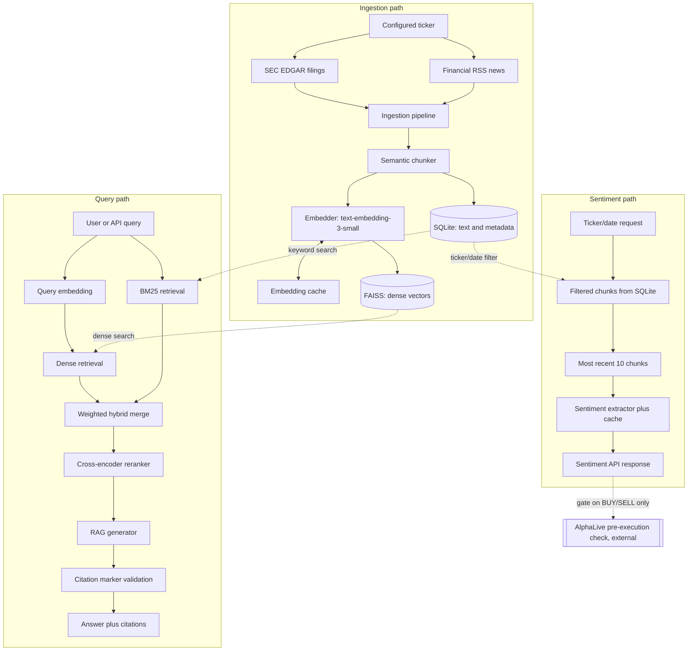

# AlphaSignal

AlphaSignal is a Python and FastAPI service that answers questions about SEC filings and financial news with source-linked citations, and separately produces a per-ticker sentiment signal. It retrieves with a hybrid of BM25 keyword search and FAISS dense vector search, reranks candidates with a cross-encoder, and generates answers that cite exactly the chunks they draw from. The sentiment signal is optional and status-aware: callers can tell "no data yet," "genuine neutral," "degraded extraction," and "fully failed" apart instead of one ambiguous score. It is consumed by [AlphaLive](https://github.com/bernardoguterres/AlphaLive), an execution and risk-management engine, as one input among several before it places a trade.

**Portfolio release.** The service runs end to end against a real local corpus, not a mocked design, and is backed by 335 passing tests covering software correctness: schema validation, citation-marker parsing, storage consistency, degraded-state handling, filter logic. Retrieval relevance and sentiment accuracy are separate questions this suite doesn't answer; see [Evaluation status](#evaluation-status) for what is and isn't measured.

## Status and evidence boundary

- **Runtime-verified:** the architecture executes against a real corpus. Citation integrity was checked against live queries with zero unresolved references, and the `/sentiment/{ticker}` no-data/degraded paths and AlphaLive's gate-bypass behavior were exercised against the running service.
- **Not benchmarked:** retrieval quality has never been measured - the golden set exists but is unannotated, see [Evaluation status](#evaluation-status). No MRR/NDCG/Hit@k numbers appear here, and the sentiment fixture does not establish validated accuracy.
- **Not deployed:** Railway configuration is present and internally consistent, but has not been exercised as a running deployment.
- **335/335 tests passing, Ruff clean, Black-formatted** - validates software behavior, not retrieval relevance or sentiment accuracy. A coverage percentage is intentionally omitted since it was not remeasured after the most recent changes.

Nothing here is investment advice.

## Engineering highlights

- **Hybrid retrieval, not single-mode search.** Dense FAISS search catches semantic matches like "revenue" against "sales"; BM25 catches exact keyword matches embeddings can blur. Combined with a configurable weight (default 40% BM25, 60% dense).
- **Cross-encoder reranking as a second pass.** `cross-encoder/ms-marco-MiniLM-L-6-v2` scores each query-chunk pair jointly, a precision pass the cheaper bi-encoder stage can't do alone.
- **Citation integrity is an enforced invariant**, not a hope - see [Hybrid retrieval and cited generation](#hybrid-retrieval-and-cited-generation).
- **Explicit degraded-state API design for sentiment** - see [Sentiment and AlphaLive integration](#sentiment-and-alphalive-integration) and [`docs/sentiment_contract.md`](docs/sentiment_contract.md).
- **Defensive SQLite/FAISS consistency** - see [Ingestion and storage integrity](#ingestion-and-storage-integrity).
- **AlphaLive integration is fail-open and scoped to entries, not exits**, exercised as a local runtime test, not validated under live trading.

## Architecture



FAISS holds only dense vectors and chunk identities; SQLite holds chunk text and metadata. Retrieval queries both and joins on chunk ID. Sentiment never touches the query path's reranked chunks - it pulls its own ticker/date-filtered set from SQLite. AlphaLive is an external consumer of `/sentiment/{ticker}`, not part of this repository.

## Ingestion and storage integrity

`IngestionPipeline` (`alphasignal/ingestion/pipeline.py`) fetches SEC EDGAR filings and RSS news per ticker, then chunks them with `SemanticChunker`. `target_tokens` (default 300) drives ordinary boundary decisions; `max_tokens` (default 400) is the hard ceiling, forcing a split within an oversized sentence and capping `target_tokens` if configured above it. `min_tokens` (default 100) guides final-fragment handling but isn't an absolute floor. `overlap_tokens` (default 50) is a maximum budget for carrying complete trailing sentences forward, not a guarantee; a hard-split sentence carries none forward. Invalid configuration normalizes to a safe value with a logged warning.

Storage splits across two systems. **SQLite** (`data/metadata.db`) owns chunk text and metadata; **FAISS** (`data/faiss_index/`) owns dense vectors and chunk identities, addressed by the same source-derived chunk IDs. Both dedupe on chunk ID and a SHA-256 `content_hash`: unchanged re-ingestion is a no-op, while a content change under an unchanged ID (an amended filing) re-embeds and replaces the stale vector.

Consistency is enforced at query time, not assumed. A FAISS vector with no recorded `content_hash` - a hashless legacy cache entry, or one added through the identity-only fallback path - is treated as unverified and excluded from dense retrieval until re-ingestion produces a hash-verified vector. A vector whose hash disagrees with the chunk's current SQLite hash is excluded the same way, as a known mismatch. Neither case hides the chunk entirely: BM25 is built from current SQLite text independently of FAISS, so an excluded chunk can still surface through keyword relevance, reported with `dense_score=0.0`. Consistency-warning logs report chunk IDs and mismatch type, never document text.

Each chunk carries an exact `source_id`. Re-ingesting a document compares its chunk set against only chunks already owned by that exact `source_id`, so removed or reflowed chunks are deleted without touching similarly named sources. Legacy rows without `source_id` fall back to a documented escaped chunk-ID-prefix match; an existing database is upgraded idempotently by adding the column with an empty default, never guessing legacy ownership. Cleaning up a source that now yields zero chunks requires the caller to supply its identity or prefix explicitly, since an empty chunk list can't reconstruct it - production ingestion paths already do this (see [Known limitations](#known-limitations)).

## Coordinated FAISS persistence

A save writes a complete, generation-numbered pair of files (a FAISS index and its chunk-ID list) rather than overwriting active files in place. The new generation is validated - dimension, vector count, no duplicate chunk IDs, agreement with the manifest's counts - before activation. A single small manifest atomically selects the current generation, so a crash between writing the new generation and updating the manifest leaves the previous, still-valid one active. Legacy flat index files are validated and migrated into this layout rather than assumed compatible. Only the current and previous generations are retained.

This is not a distributed transaction: SQLite, FAISS, and the embedding cache do not commit together. Recovery relies on idempotent re-ingestion plus the query-time exclusion of unverified or mismatched dense vectors described above.

## Hybrid retrieval and cited generation

`HybridRetriever.retrieve()` runs dense FAISS and sparse BM25 search independently over their own candidate pools (default 50), min-max normalizes both score sets, and combines them with configurable weights (default `bm25: 0.4, dense: 0.6`). The top `rerank_candidates` (default 20) go to `CrossEncoderReranker`, which returns the requested `top_k` (default 5, max 20).

`RAGGenerator` builds a numbered `[Source N]` context block from the reranked chunks and asks the model to answer only from it. `_parse_citations()` then enforces citation integrity before the response is returned: resolvable markers are renumbered sequentially, and any marker beyond what was retrieved is stripped from the answer text.

## Sentiment and AlphaLive integration

`/sentiment/{ticker}` pulls ticker/date-filtered chunks from SQLite, independently of the query path, sorts them by date descending, and runs at most the 10 most recent through `SentimentExtractor`. Results are cached per chunk in memory (not persisted) for 24 hours, resetting on restart.

The response distinguishes five situations, documented in full in [`docs/sentiment_contract.md`](docs/sentiment_contract.md) - the machine-readable API contract for telling successful, no-data, partially degraded, fully degraded, and failed requests apart. `status: "ok"` covers genuine extraction including genuine neutral sentiment (`latest_score` may legitimately be `0.0`). `status: "no_data"` means no chunks were ever ingested, returning `latest_score: null`. Partial degradation means some chunks fell back to a provider/parsing default while others produced a real prediction; it returns the most recent *reliable* score, flagged `status: "degraded"`, `degradation_reason: "partial_extraction_failure"`. Full degradation means every chunk fell back, returning `latest_score: null` rather than a fabricated value, flagged `"full_extraction_failure"`. Unhandled failures raise as HTTP 5xx, never a misleading 200. Per-chunk `SentimentSignal.reliable` and response-level `reliable_chunk_count`/`total_chunk_count` make the fallback-versus-genuine split explicit. `/sentiment/{ticker}/summary` builds its aggregate score and trend from reliable signals only, reporting the same degradation metadata.

AlphaLive's `run_pre_execution_checks()` consults `/sentiment/{ticker}` only for strategy-generated BUY/SELL signals, never protective exits, and reads the full contract rather than a bare score. A `no_data` response, a timeout, a network/HTTP error, or a disabled integration fail open with a distinct logged reason. A degraded response that's unusable - no reliable chunks, or a null score - fails open the same way, with its own logged reason so it isn't confused with clean no-data. A degraded response that's structurally valid and usable - at least one reliable chunk and a non-null score - is evaluated against AlphaLive's normal threshold like any other score, but the decision is tagged partially degraded so it's never mistaken for one made on a clean signal. A malformed or self-contradictory contract also fails open, categorically. Passing or bypassing the gate never bypasses AlphaLive's own independent risk and execution checks.

AlphaLab does not call this API - it uses `yfinance` directly.

## Evaluation status

There are two separate, unrelated evaluation assets - do not confuse them:

| Asset | Purpose | Size | Status |
|---|---|---|---|
| `evaluation/retrieval_golden_set.json` | Retrieval quality (MRR/NDCG/Hit@k) | 50 questions, 10 tickers | Unannotated - `relevant_chunk_ids` empty everywhere |
| `alphasignal/evaluation/sentiment_golden_set.json` | Event-sentiment diagnostic fixture | 15 labeled events | Labeled, but methodologically limited as an accuracy measure - see below |

**Retrieval:** `benchmark.py` refuses to run against the unannotated golden set rather than report meaningless all-zero metrics; annotation (`annotate_golden_set.py`) has to happen first. Its four configurations only vary hybrid weighting and reranking - "naive vs. semantic chunking" labels are aspirational, since only `SemanticChunker` exists.

**Sentiment:** the 15-entry fixture carries explicit `expected_sentiment` labels, but `run_eval.py` calls `GET /sentiment/{ticker}?date_to=<event_date>` and never submits the event description to the model - it measures corpus context around a known date, not whether the model interprets a described event. Accuracy and the Sharpe-style backtest use only genuinely produced, available predictions; an unavailable one is never substituted with its own expected label, and prediction coverage (`predictions_available / actionable`) is reported separately. Events inside the 2020-2023 gap show up as reduced coverage, not a misleading result. Committed dated result files document this fixture's output, not validated accuracy.

**Bottom line:** retrieval quality is unmeasured and no validated sentiment or predictive-quality claim is made here. Closing the gap needs the retrieval questions annotated, benchmarked, and corpus coverage extended so "unavailable" is the answer less often.

**Local corpus evidence, not committed data:** `data/` is gitignored, so this describes this machine's local corpus, not what ships in or is reproducible from a fresh clone. `data/metadata.db` holds 42,078 chunks across the 12 configured tickers (AAPL, MSFT, GOOGL, AMZN, NVDA, META, TSLA, JPM, GS, MS, SPY, QQQ), with SEC coverage split across 2015-2019 (backfill) and 2024-2026 (regular ingestion) - 2020 through 2023 has no data for any ticker. Constrained requests get documented no-data behavior: `/sentiment/{ticker}` returns `data_available: false`/`latest_score: null`, `/query` returns an empty `citations` array.

## API example

Shapes below match `alphasignal/api/schemas.py`. Answer text, scores, and latency are illustrative - representative, not a captured live response.

```bash
curl -X POST http://localhost:8000/query \
  -H "Content-Type: application/json" \
  -d '{"query": "What were Apple'\''s key revenue drivers in fiscal 2024?", "ticker_filter": "AAPL", "top_k": 5}'
```

```json
{
  "query": "What were Apple's key revenue drivers in fiscal 2024?",
  "answer": "Driven primarily by iPhone sales and continued growth in Services [Source 1].",
  "citations": [
    {
      "chunk_id": "aapl_10k_a1b2c3d4_0007",
      "ticker": "AAPL",
      "source": "SEC EDGAR",
      "date": "2024-09-28",
      "excerpt": "iPhone revenue increased year-over-year...",
      "relevance_score": 0.91
    }
  ],
  "latency_ms": 340,
  "retrieval_scores": [0.91, 0.84],
  "model_used": "gpt-5.6-luna"
}
```

`ticker_filter` is a single string, not a list - the retrieval stack only ever supported one ticker per query.

## Quick Start

```bash
git clone https://github.com/bernardoguterres/AlphaSignal.git
cd AlphaSignal
python -m venv venv && source venv/bin/activate
pip install -r requirements.txt
export OPENAI_API_KEY=your_key_here

# Build the corpus (real OpenAI embedding calls - costs money)
python alphasignal/scripts/build_corpus.py

# Start the API
uvicorn alphasignal.api.app:app --reload --host 0.0.0.0 --port 8000
# docs at http://localhost:8000/docs
```

**Environment variables:** `OPENAI_API_KEY` (required); `ALPHASIGNAL_API_KEY` (recommended before public exposure) - when set, every route except `/health` requires a matching `X-API-Key` header. Unset means open access, logged as a startup warning - fine locally, not for a reachable deployment, since open `/query`/`/ingest` would let anyone spend the OpenAI budget.

**`config.yaml`** controls tickers, chunking, retrieval weights, model names, and storage paths.

**Railway:** `Dockerfile`, `Procfile`, and `railway.toml` are internally consistent configuration; an actual deployment has not been exercised. `data/` is excluded from the Docker image, so a real deployment needs a persistent volume at `/app/data` or every redeploy wipes the corpus.

## Compact API reference

| Endpoint | Purpose | Auth |
|---|---|---|
| `POST /query` | Hybrid retrieval and reranked, cited RAG answer | X-API-Key when configured |
| `GET /sentiment/{ticker}` | Per-document sentiment signals, optional date range | X-API-Key when configured |
| `GET /sentiment/{ticker}/summary` | Aggregate score, trend, reliable-signal count | X-API-Key when configured |
| `POST /ingest/{ticker}` | Full ingest, chunk, embed, store for one ticker | X-API-Key when configured |
| `POST /ingest/batch` | Multi-ticker ingest, one BM25 rebuild | X-API-Key when configured |
| `GET /health` | FAISS/SQLite load status, chunk count | None (healthcheck can't send headers) |
| `GET /metrics` | Latency percentiles, error counts | X-API-Key when configured |

Ticker handling is a deliberate policy, not one uniform shape. `GET /sentiment/{ticker}` (and `/summary`) and `POST /ingest/{ticker}` treat the ticker as a resource identifier, so an unconfigured ticker returns `404`. `POST /ingest/batch` instead records it as a per-item `"failed"` result, so one bad item doesn't discard the rest of the batch. `POST /query`'s `ticker_filter` is an optional search filter, not a resource identifier - an unrecognized value simply yields no matching chunks.

## Verification

335 tests pass (`pytest`), the codebase is Ruff-clean, and it is Black-formatted. These tests check software correctness - schemas, citation-marker parsing, storage consistency, filter logic, caching, degraded-state handling, no-data semantics - not whether retrieval finds the right chunks or sentiment scores are accurate. Neither is currently measurable; see [Evaluation status](#evaluation-status) for why the sentiment fixture doesn't substitute for accuracy measurement and why the retrieval golden set remains unannotated.

## Known limitations

- **Retrieval quality is unmeasured; sentiment quality is unvalidated.** See [Evaluation status](#evaluation-status).
- **2020-2023 corpus gap** - no ingested data for any ticker; constrained requests get documented no-data behavior, not a wrong answer.
- **Local, gitignored corpus evidence** - the 42,078-chunk figure describes this machine only, not a committed or fresh-clone-reproducible dataset.
- **No distributed transaction across SQLite, FAISS, and the embedding cache** - recovery relies on idempotent re-ingestion and query-time exclusion of unverified/mismatched vectors.
- **FAISS vector replacement is O(index size)** - `IndexFlatIP` has no update/remove-by-position primitive, so replacement rebuilds the index; fine at this scale, not for very large deployments.
- **A fully empty source needs the caller to supply its identity/prefix explicitly** to be cleaned up; production paths already do this.
- **Synchronous ingestion (~45s/ticker)** runs in FastAPI's thread pool but still consumes worker capacity; no queued/background ingestion, no `/query` caching, and single-node in-memory FAISS with no distributed or vector-database scaling.
- **Railway deployment is unexercised** - configuration is consistent, but no live deployment has been run.
- **AlphaLive integration is a local runtime test, not live-trading validation**, and only gates BUY/SELL, never exits.
- **AlphaLab is not connected** - it calls `yfinance` directly.

## License and contributions

All rights reserved - proprietary work; no license is granted for reuse, copying, or redistribution. Contribution pull requests are welcome for review at the maintainer's discretion, but do not grant anyone a license to the rest of the codebase.
